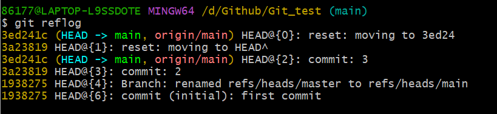

# 第一次提交

```bash
echo "# GIT_test" >> README.md`
git init `这行命令是在当前目录下初始化一个Git仓库。
git add README.md `这行命令是将README.md文件添加到Git的暂存区，准备提交。
git commit -m "first commit" `这行命令是提交README.md文件到本地仓库，并添加了一条提交信息 "first commit"。
git branch -M main `这行命令是将当前的分支（通常是master）重命名为main。
git remote add origin git@github.com:Yangzepeng5382/GIT_test.git `添加为本地仓库的远程仓库，并将其命名为origin。
git push -u origin main `这行命令是将本地仓库的main分支推送到远程仓库的main分支，并将它们关联起来。
```


# 时光穿梭机

```bash
git diff readme.txt  `查看现在的修改与上一次的提交有什么区别
```


# 版本回退

```bash
git log `查看所有提交的分支`
git log --pretty=oneline `更加简洁`
git reset --hard HEAD^ `回退到上一个版本`
git reset --hard 1094a `回退到log看到的版本`
git reflog `查看历史git命令`
```



